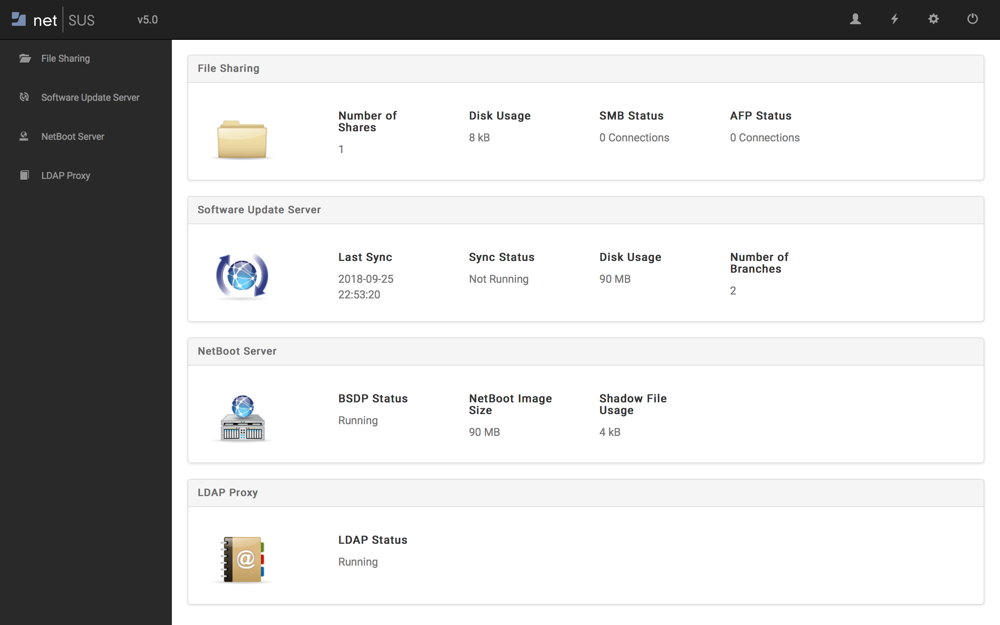

# NetSUS Downloads

Installer:
[https://www.dropbox.com/s/c3aeii38qh6c05y/NetSUSLPInstaller_4.2.1.run?dl=0](https://www.dropbox.com/s/c3aeii38qh6c05y/NetSUSLPInstaller_4.2.1.run?dl=0)

OVA:
[https://www.dropbox.com/s/zfkmsqx1cuope79/NetSUSLP_4.2.1.ova?dl=0](https://www.dropbox.com/s/zfkmsqx1cuope79/NetSUSLP_4.2.1.ova?dl=0)

# What is NetSUS?

The NetBoot/SUS/LP server allows you to host an internal software update server (SUS), a NetBoot server, and a LDAP Proxy server **all on the same Linux system**. For a list of supported Linux distributions see [Requirements](#requirements).

* **Software Update Server** - Unlike a standard SUS, the SUS hosted by the NetBoot/SUS/LP server allows you to control which software updates should be installed on each computer in your organization.

* **NetBoot Server** - The NetBoot/SUS/LP server allows you to host a NetBoot image. You can boot computers to a NetBoot image in place of a recovery partition or external drive when imaging.

* **LDAP Proxy** - Use the NetBoot/SUS/LP server as a lightweight proxy that acts as a middleware layer between LDAP clients and LDAP directory servers.

* **Web Application** - The NetBoot/SUS/LP server includes a web application that can be used to easily manage your NetBoot and Software Update Servers as well as your LDAP Proxy. The dashboard page is shown above.

## Documentation

For a getting started guide and step-by-step walkthroughs check out the **[documentation for the current release](docs/README.md)**

## Requirements

#### Supported Linux distributions:

* Ubuntu 14.04 LTS Server
* Ubuntu 16.04 LTS Server
* Red Hat Enterprise Linux (RHEL) 6.4 or later
* CentOS 6.4 or later

#### To install the NetBoot/SUS/LP server using an installer, you need:

* The NetBoot/SUS/LP Server Installer (.run), available at:  
<https://www.jamf.com/jamf-nation/third-party-products/180/netboot-sus-appliance?view=info>
* 500 GB of disk space available 
* 1 GB of RAM

#### To set up the NetBoot/SUS/LP server as an appliance, you need:

* The OVA file for the NetBoot/SUS/LP server, available at:
<https://www.jamf.com/jamf-nation/third-party-products/180/netboot-sus-appliance?view=info>
* Virtualization software that supports Open Virtualization Format 
* 500 GB of disk space available
* 2 GB of RAM

**Only Intel-based Macs can use a NetBoot server hosted by the NetBoot/SUS/LP server.**
