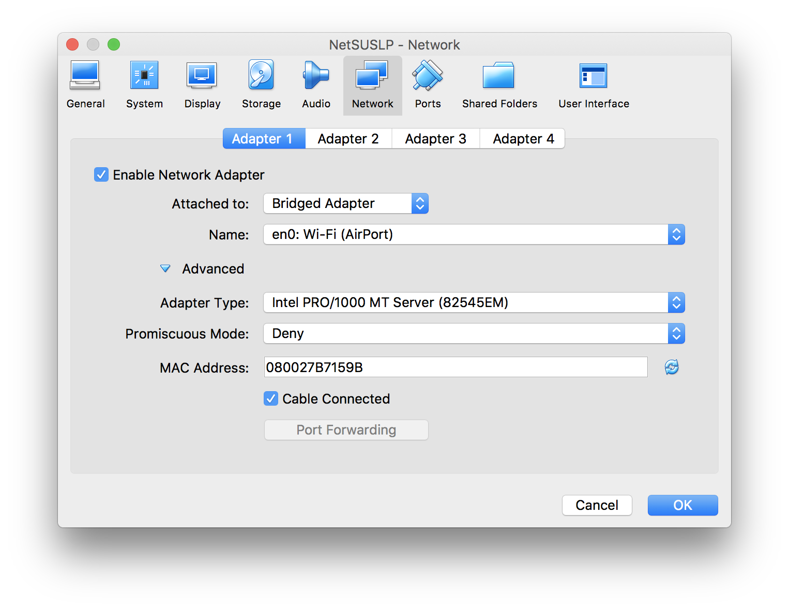
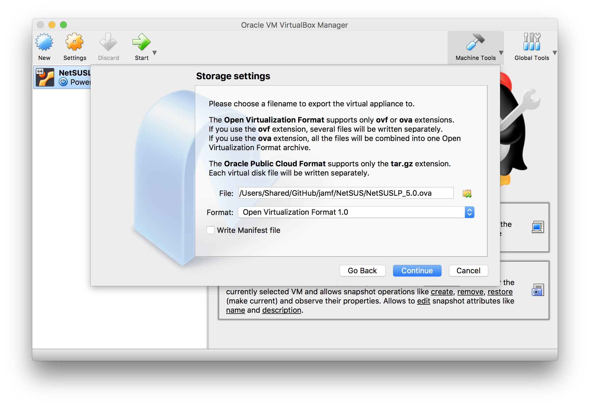

# Creating the NetSUSLP Appliance

### This guide is for project administrators of the NetSUSLP application. 

The following instructions describe how to use VirtualBox and Packer (utilizing the files contained in the 'appliance' directory) to create an appliance (ova file) of the NetSUSLP application. 

The purpose of the appliance file is to give users an easy to setup virtual machine that already has the NetSUSLP application installed. With the appliance the user can simply import the ova file into their preferred virtualization software and have a running NetSUSLP server. 

## Requirements

**All requirements are open source and free to use for the purposes of this guide.**

* VirtualBox 
* Packer

## Installation

There are several options for installing VirtualBox and Packer. You can either download the installers found below or use various command line options. On a Windows or Redhat host machine it is best to use the downloaded installers. 

* VirtualBox [Download Installer Here](https://www.virtualbox.org/wiki/Downloads)
* Packer [Download Installer Here](https://www.packer.io/downloads.html)

On a OSX host machine using homebrew

	$ brew cask install virtualbox
	$ brew install packer
	
On a Debian host machine (Ubuntu). For packer you will need to use the downloaded installer

	$ sudo apt-get install virtualbox
		
	
## 1. Create the Base VM with Packer

1. Make sure any changes made to the NetSUSLP codebase are finalized and tested. If you do not have the current repository on your host machine, you will need to clone it. 

		$ git clone https://github.com/jamf/NetSUS.git
		
2. You will now create the installer for NetSUSLP. Running the CreateNetSUSInstaller.sh script will create a NetSUSLPInstaller.run file. In the base directory of your NetSUS project run the command:

		$ sudo ./CreateNetSUSInstaller.sh
		
3. You will now utilize packer to create a base VM with the necessary virtual hardware specifications. The created VM will not have NetSUSLP installed nor have the correct network settings. This process will take some time as it is downloading an iso image of Ubuntu and installing it onto a VM. You can observe the installation by starting VirtualBox and opening the 'NetSUSLP_Setup' VM. Packer will take care of the input necessary to install Ubuntu. To proceed run this command in the `NetSUS/appliance/` directory:

		$ packer build setup.json
		
## 2. Install NetSUSLP on the Base VM

1. Once the packer build is finished the created ovf file will be located in `NetSUS/appliance/output-virtualbox-iso/`

2. Open VirtualBox and import the created ovf file located in the directory above. To import an ovf file select `File -> Import Appliance -> select file` in the VirtualBox manager page.

3. Before you spin up the imported VM you will want to add some network settings that will allow the VM to gain access to the internet. You can access the settings by right clicking on the NetSUSLP_Setup VM and selecting 'Settings', then enter the 'Network' tab. The settings that will depend on your host machine's hardware and network environment are 'Attach' and 'Name'. The 'Advanced' section must be set as depicted here:
	
 	
	
4. You can now start the VM with the new network settings. The default username and password will be `username: shelluser, password: shelluser`. Before installing NetSUSLP you will want to verify that your VM has internet access. Run a command such as `$ ping google.com` and ensure you receive a response.

5. Now you must restart the VM. It is important to make sure the VM gets fully powered off before running the NetSUSLP installer. Run this command:
	
		$ sudo shutdown -P now
		
6. Start the VM again through VirtualBox. The installer for NetSUSLP is located in the shelluser home directory. To make the installer runnable, run this command:
		
		$ chmod +x NetSUSLPInstaller.run
		
7. Now you must run the installer with sudo permission. Answer 'yes' for any input the installer asks for. Run this command:

		$ sudo ./NetSUSLPInstaller.run
		
## 3. Export the VM as an OVA File

1. Now you will export the VM with NetSUSLP installed. After verifying that the application is working correctly on the VM, power it down.

2. In VirtualBox manager, select `File -> Export Appliance -> NetSUSLP_Setup -> Continue`

3. Now select a location to put the exported ova file. Be sure to name the the file `NetSUSLP_<release_version> and select the OVF 2.0 format.

	
	
4. When finished make sure no iso, ova, or ovf file is included in the repository.
	
	
	

	
