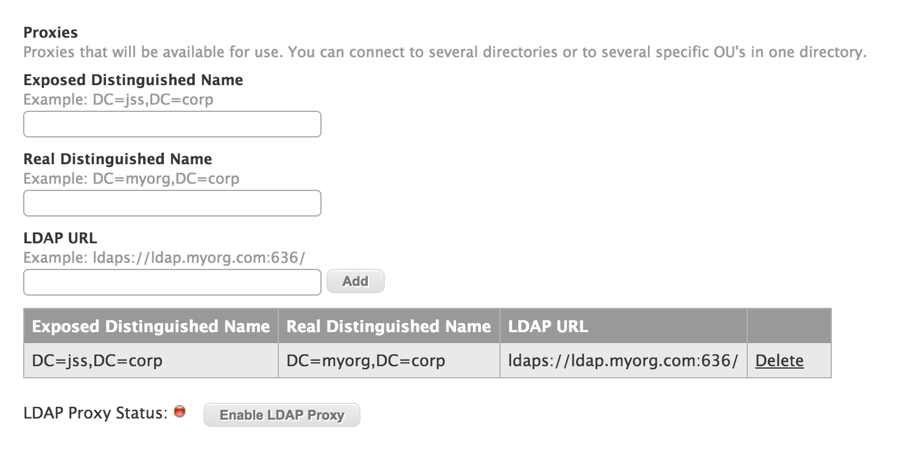
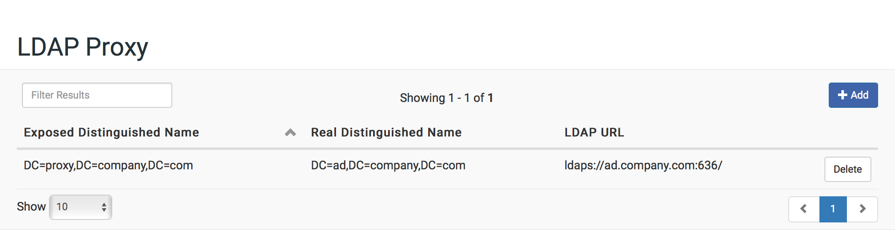

# LDAP Proxy Server

> JAMF customers, please note that Jamf Pro now has an LDAP Proxy Service integrated with the Infrastructure Manager that is distinct from this appliance's version.<br>
> It is recommended to use the Infrastructure Manager rather than the LDAP Proxy Service.

The LDAP Proxy Server is a proxy server that allows you to expose an access point to an LDAP Server. In doing so it allows you to adjust the distinguished name to whatever you choose. You may find the following diagram helpful when filling out your proxy information.


## Enabling LDAP Proxy

1. Log in to the NetSUSLP web application.

2. In the top-right corner of the page, click **Settings**  .

3. In the "Services" section, click **LDAP Proxy**  .

4. In the top-right corner of the page, click the  toggle so it displays  .


## Configuring Proxies

1. Log in to the NetSUSLP web application.

2. Click **LDAP Proxy** in the side navigation menu.

3. Click the **+ Add** button in the upper-right of the table.

3. Enter your **Exposed Distinguished Name** that you intend to use to reach the proxy. For more information, see [Exposed Distinguished Name](#edn)

4. Enter your **Real Distinguished Name** that you use to connect to the LDAP Server. For more information, see [Real Distinguished Name](#rdn)

5. Enter your **LDAP Host** with the port of the LDAP Server. For more information, see [LDAP Host](#lu)

6. Click **Save**. The service will start automatically.

	

7. Enter as many other LDAP Connections as you want to configure

	


## <a name="edn"></a>Exposed Distinguished Name

This is the distinguished name of name of your proxy, which will serve as your exposed access point. This can be named however you wish. For example: 

You want to name your Proxy as `proxy.company.com`, you would enter `DC=proxy,DC=company,DC=com`

**Note**: Pointing multipile Real Distinguished Names and URL's to the same Exposed Distinguished Name is currently not supported on the NetSUS. However this is possible by editing the  `slapd.conf` configuration file on your server device commonly located here: `/etc/ldap/slapd.conf`. This file is re-written each time you activate the NetSUS LDAP proxy. For more information on this topic, see the [OpenLDAP Documentation](http://www.openldap.org/doc/admin24/slapdconfig.html)


## <a name="rdn"></a>Real Distinguished Name

This is the distinguished name of your LDAP that the Proxy is pointing to. This must be named according to your LDAP. For example:

Your LDAP's host name is `ad.company.com`, you would enter `DC=ad,DC=company,DC=com`

If you want to point your Proxy to a more specefic section of your LDAP, you can add additional attributes along with the DC (Domain Component) attributes. For example: `DC=ad,DC=company,DC=com,OU=people`. This would point your proxy to only the "people" organizational unit of your LDAP.

The additional attributes you define in the "Real Distinguished Name" are all dependent on the structure of your LDAP server.


## <a name="lu"></a>LDAP Host

This is the Host and Port of the LDAP server your proxy is pointing to:

* `<hostname>` is the name (or IP address in dotted format) of the LDAP server (for example, ads.myorg.com or 192.202.185.90).
* `<port>` is the port number of the LDAP server (for example, 696). If no port is specified, the standard LDAP port (389) is used.

### URL Examples
```
ldap://ad.myorg.com:696/
```
```
ldap://192.202.185.90:389/
```
**Note**: While there are more attributes you can define in the URL, it is recomended that you input only the syntax defined above. If you wish to limit your proxy to a specific section of your LDAP you can add the specific attributes to the "Real Distinguished Name".

