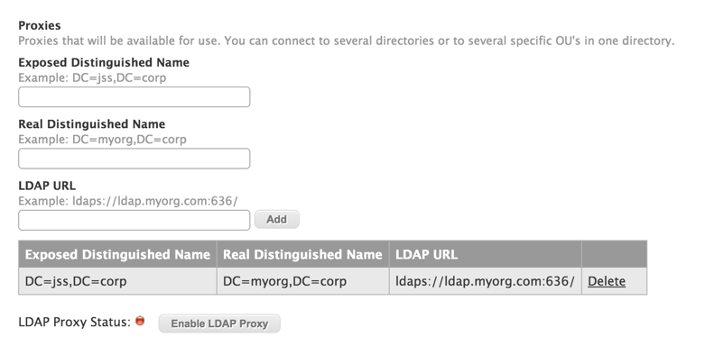

# LDAP Proxy Server
The LDAP Proxy Server is a proxy server that allows you to expose an access point to an LDAP Server. In doing so it allows you to adjust the distinguished name to whatever you choose, as well as allows you to put multiple LDAP Servers and sections under the same distinguished name.

1. Log in to the NetBoot/SUS/LP server web application.

2. Click **LDAP Proxy Server**.
On a smartphone, this option is in the pop-up menu.

3. Enter your "Exposed Distinguished Name" that you intend to use to reach the proxy. For more information, see [Exposed Distinguished Name](#edn)

4. Enter your "Real Distinguished Name" that you use to connect to the LDAP Server. For more information, see [Real Distinguished Name](#rdn)

5. Enter your "LDAP URL" with the port of the LDAP Server. For more information, see [LDAP URL](#lu)

6. Click "Add"

<p align="center"></p>

7. Enter as many other LDAP Connections as you want to configure. 

8. Click "Enable LDAP Proxy".


## <a name="edn"></a>Exposed Distinguished Name

This is the distinguished name of name of the Proxy, which will serve as your exposed access point. This can be named however you wish. For example: 

You want to name your Proxy as `proxy.company.com`, you would enter `DC=proxy,DC=company,DC=com`

**Note**: Pointing multipile LDAP servers to a single Exposed Distinguished Name is currently not supported on the NetBoot/SUS/LP.

## <a name="rdn"></a>Real Distinguished Name

This is the distinguished name of your LDAP that the Proxy is pointing to. This must be named according to your LDAP. For example:

Your LDAP's host name is `ad.company.com`, you would enter `DC=ad,DC=company,DC=com`

If you want to point your Proxy to a more specefic section of your LDAP, you can add additional attributes along with the DC (Domain Component) attributes. For example: `DC=ad,DC=company,DC=com,OU=people`. This would point your proxy to only the "people" organizational unit of your LDAP.

## <a name="lu"></a>LDAP URL

This is the URL of the LDAP server your proxy is pointing to. You can enter the base address of your LDAP to include everything in your proxy or define additional attributes to point to a specific section. An entry must have the following syntax:

	ldap[s]://<hostname>:<port>/
	
* `ldap://` is the protocol is used to connect to LDAP servers over unsecured connections. 
* `ldaps://` is the protocol is used to connect to LDAP servers over SSL connections.
* `<hostname>` is the name (or IP address in dotted format) of the LDAP server (for example, ads.myorg.com or 192.202.185.90).
* `<port>` is the port number of the LDAP server (for example, 696). If no port is specified, the standard LDAP port (389) is used.
 
### URL Examples
```
ldap://ad.myorg.com:696/
```
```
ldap://192.202.185.90:389/
```


	


