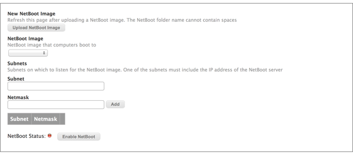
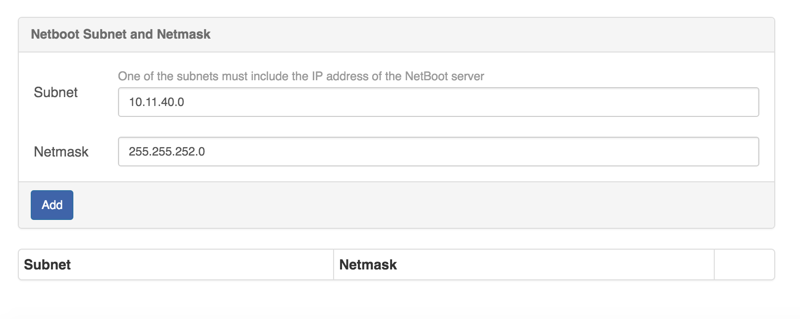

# Setting Up the NetBoot Server

To set up a NetBoot server, you need a NetBoot image (.nbi folder). For more information, see the following Knowledge Base article:
[Creating a NetBoot Image and Setting Up a NetBoot Server](https://www.jamf.com/jamf-nation/articles/307/creating-a-netboot-image-and-setting-up-a-netboot-server)

1. Log in to the NetBoot/SUS/LP server web application.

2. Click **NetBoot Server** in the side navigation menu or in the mobile dropdown menu.

3. Upload a NetBoot image:
	* Click **Upload NetBoot Image**.

		
		
	* You will be connected to the SMB share where NetBoot images are stored.
	* Enter credentials for the SMB share and click **Connect**.
	* Copy a NetBoot image folder (.nbi extension) to the SMB share. The nbi folder must contain a .plist file and .dmg file to function properly.

	**Important:** The name of the folder cannot contain any spaces.

4. Return to the NetBoot/SUS/LP server web application and refresh the page.

5. Select the radio button for the NetBoot image.

6. **Optional:** Click on the Image name to edit the Image properties. For common issues on this setting please see the troubleshooting section below. 

7. Choose subnets for the NetBoot image by entering a subnet and a netmask. Then click **Add**. 

	**Important**: One of the subnets must include the IP address of the NetBoot server.
	
	

8. Click **Enable NetBoot**. If NetBoot is successfully enabled, the NetBoot status alert turns green.

## Troubleshooting

The best place to gather information on why your NetBoot Server might not be working is the "dhcpd" service logs in your system's default log locaion. For example:

On Debian family distributions you would enter the command

`grep "dhcpd" /var/log/syslog`

On Red Hat family distributions you would enter the command

`grep "dhcpd" /var/log/messages`

Either of these commands will output a list of logs related to the dhcpd service to your console window.
	
## Using the NetBoot Server with Jamf Pro

**Note**: The instructions in this section are for Jamf Pro v9.0 or later. However, if you are using the Casper Suite v8.x, these instructions can still be followed loosely.

Like standard NetBoot servers, you can add the NetBoot server hosted by the NetBoot/SUS/LP server to Jamf Pro. This allows you to use a policy or Jamf Remote to boot managed computers to a NetBoot image.

When adding the NetBoot server to Jamf Pro, enter the IP address specified in the NetBoot/SUS/LP server web application and choose the “Use default image” option from the NetBoot Image pop-up menu.

For more information on adding a NetBoot server to Jamf Pro, see the “NetBoot Servers” section in the Jamf Pro Administrator’s Guide.

For more information on using a policy or Jamf Remote to boot computers to a NetBoot image, see the “Booting Computers to NetBoot Images” section in the Jamf Pro Administrator’s Guide.