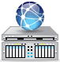
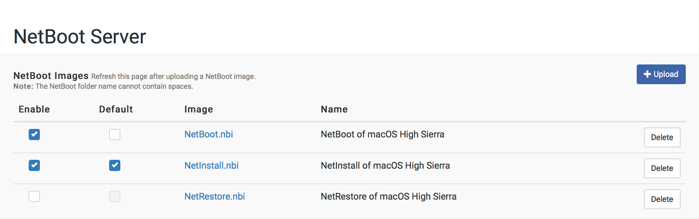

# Setting Up the NetBoot Server

To set up a NetBoot server, you need a NetBoot image (.nbi folder). For more information, see the following Knowledge Base article:
[Creating a NetBoot Image and Setting Up a NetBoot Server](https://www.jamf.com/jamf-nation/articles/307/creating-a-netboot-image-and-setting-up-a-netboot-server)

## Enabling NetBoot
**Note**: In NetSUSLP v5.0 the BSDP service is no longer provided by DHCP, so subnet definitions are not required.

1. Log in to the NetSUSLP web application.

2. In the top-right corner of the page, click **Settings**  .

3. In the "Services" section, click **NetBoot Server**  .

4. In the top-right corner of the page, click the  toggle so it displays  .\
   All related services will automatically start.

5. Select the engine (BSDP/DHCP) you wish to use to broadcast the NetBoot image information.
	**Note**: BSDP supports multiple images, but will not broadcast across subnets.
	**Note**: DHCP broadcasts across subnets, but only supports a single image.

6. **Optional**: If using DHCP, specify the network interface you wish to use to broadcast the NetBoot image information.
	**Note**: The subnet definition for the selected network interface is automatically added.

6. **Optional**: If using DHCP, add additional subnet definitions for the networks you wish to enable NetBoot on.

## Uploading a NetBoot Image

1. Log in to the NetSUSLP web application.

2. Click **NetBoot Server** in the side navigation menu.

3. Upload a NetBoot image:
	* Click **Upload NetBoot Image**.

		
		
	* You will be prompted to connect to the SMB share where NetBoot images are stored.
	* Enter credentials for the SMB share and click **Connect**.
	* Copy a NetBoot image folder (.nbi extension) to the SMB share. The nbi folder must contain a .plist file and .dmg file to function properly.

		**Note**: The name of the folder cannot contain any spaces.

4. Return to the NetSUSLP web application and refresh the page.

## Managing NetBoot
**Note**: Changes made take effect immediately, the service does not need to be restarted.

1. Log in to the NetSUSLP web application.

2. Click **NetBoot Server** in the side navigation menu.

3. Click the check boxes for the images you wish to enable.

4. Optionally, click the checkbox for the image you wish to set as the default (when holding the 'N' key during client startup).

	

## Changing Image Properties
**Note**: Changes made take effect immediately, the service does not need to be restarted.

1. Log in to the NetSUSLP web application.

2. Click **NetBoot Server** in the side navigation menu.

3. Click the NetBoot Image you want to change.

4. Update the image properties in the modal dialog.

## Using the NetBoot Server with Jamf Pro

**Note**: The instructions in this section are for Jamf Pro v9.0 or later. However, if you are using the Casper Suite v8.x, these instructions can still be followed loosely.

Like standard NetBoot servers, you can add the NetBoot server hosted by the NetSUSLP to Jamf Pro. This allows you to use a policy or Jamf Remote to boot managed computers to a NetBoot image.

When adding the NetBoot server to Jamf Pro, enter the IP address specified in the NetSUSLP web application and choose the "Use default image" option from the NetBoot Image pop-up menu.

For more information on adding a NetBoot server to Jamf Pro, see the "NetBoot Servers" section in the Jamf Pro Administrator’s Guide.

For more information on using a policy or Jamf Remote to boot computers to a NetBoot image, see the "Booting Computers to NetBoot Images" section in the Jamf Pro Administrator’s Guide.