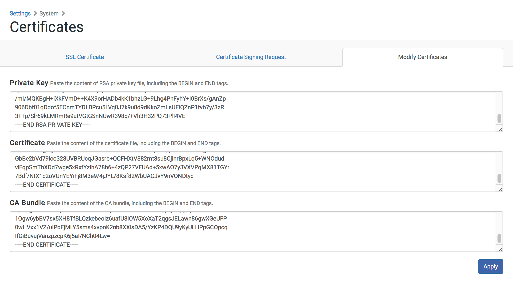

# Settings
Walkthroughs for options on the **Settings**  page.

On a mobile device these options are available from the navigation drop down menu.

## Restarting the AFP or SMB Share
You may need to restart the AFP or SMB share for troubleshooting purposes.

1. Log in to the NetBoot/SUS/LP server web application.

2. In the side navigation menu or in the mobile dropdown menu, click **Settings**  .

3. In the "Shares" section, click **AFP** or **SMB** .

4. Click **Restart**.

## Disabling the GUI
The User Menu now adds additional functionality to be able to Disable GUI.

1. Log in to the NetBoot/SUS/LP server web application.

2. In the side navigation menu or in the mobile dropdown menu, click the username drop down.

3. In the drop down list select Disable GUI.

4. Click **Disable** to continue with Disable GUI.

5. Reload the NetBoot/SUS/LP server in your browser.

## Enabling the GUI
The NetBoot/SUS/LP server allows you to enable a disabled GUI by modifying the configuration file on the NetBoot/SUS/LP Server.

1. Log in to the server as a user with superuser privileges.

2. Modify the file at the following location:

		/var/appliance/conf/appliance.conf.xml

3. Remove the following elements from the file:

		<webadmingui>disabled</webadmingui>

4. Save the appliance.conf.xml file.

5. Reload the NetBoot/SUS/LP server in your browser

## Network Settings
The Network settings allow you to configure the following:

* Hostname
* Network type (DHCP or static) 
* IP address
* Netmask
* Gateway
* DNS servers 
* Enabling/Disabling SSH
* Enabling/Disabling Firewall

1. Log in to the NetBoot/SUS/LP server web application.

2. In the side navigation menu or in the mobile dropdown menu, click **Settings**  .

3. In the "NetBoot/SUS/LDAP Proxy Server" section, click **Network** .

4. Configure the settings on the pane.

5. Click **Save**.

## Date/Time Settings
The Date/Time settings allow you to do the following:

* View the current time on the NetBoot/SUS/LP server. 
* Change the current time zone on the NetBoot/SUS/LP server. 
* Use a network time server to synchronize the date/time.

1. Log in to the NetBoot/SUS/LP server web application.

2. In the side navigation menu or in the mobile dropdown menu, click **Settings**  .

3. In the "NetBoot/SUS/LDAP Proxy Server" section, click **Date/Time**  .

4. Configure the settings on the pane.

5. Click **Save**.

## Certificates Settings
Certificates Settings allows you to modify the server settings with either a Tomcat or Slapd certificate to be used for communication with the NetSUSLP Server.

1. Log in to the NetBoot/SUS/LP server web application.

2. In the side navigation menu or in the mobile dropdown menu, click **Settings**  .

3. In the "NetBoot/SUS/LDAP Proxy Server" section, click **Certificates**  .

4. Enter the "Private Key", "Certificate", and "Chain" fields with the appropriate unencrypted certificate information.
	
    

5. Click **Save**.

6. Restart NetBoot/SUS/LP Server.
