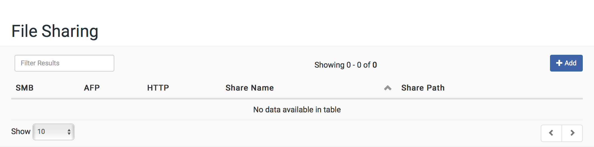
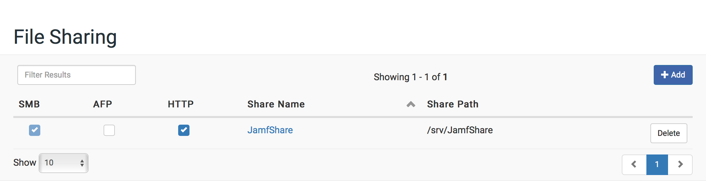

# File Sharing

## Setting Up File Sharing

1. Log in to the NetSUSLP web application.

2. In the top-right corner of the page, click **Settings**  .

3. In the "Services" section, click **File Sharing**  .

4. In the top-right corner of the page, click the  toggle so it displays  .

5. Optionally, enable or disable the required protocols.
   **Note**: If NetBoot is enabled the AFP service will be started automatically, and the service controls disabled.

## Adding a File Share

1. Log in to the NetSUSLP web application.

2. Click **File Sharing** in the side navigation menu.

	

3. Click the **+ Add** button in the upper-right of the table.

4. Enter the Share Details in the modal dialog.

5. Click **Save**.

6. Optionally, enable any additional protocols for the share.
   **Note**: You will be prompted to enable a service for any protocols not running.

	

## Share Permissions

1. Log in to the NetSUSLP web application.

2. Click **File Sharing** in the side navigation menu.

3. Click the name of the share you wish to manage.

4. Check the appropriate permissions for the users.
   **Note**: See [Accounts](accounts.md) for notes about adding additional users.

