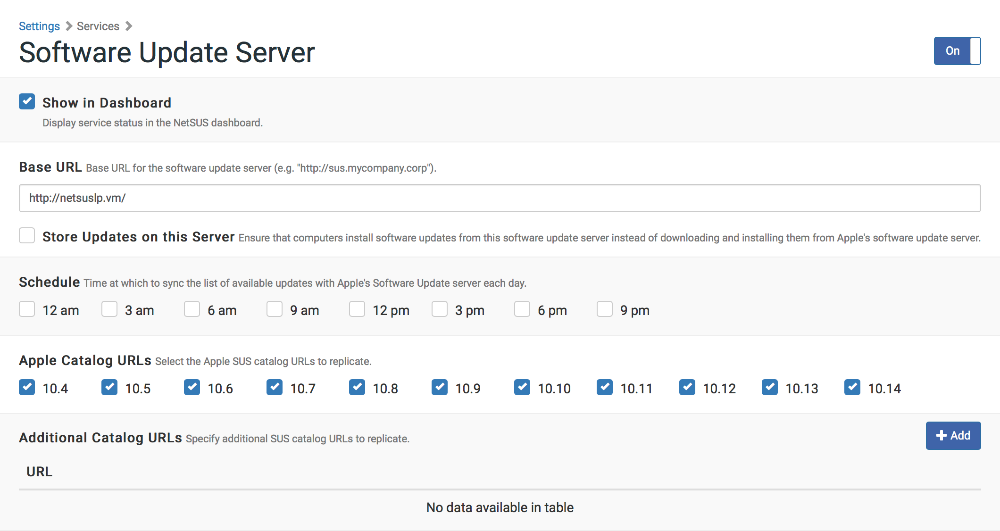
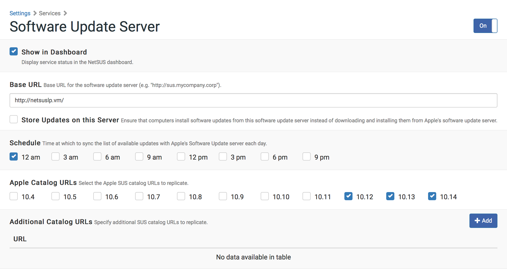
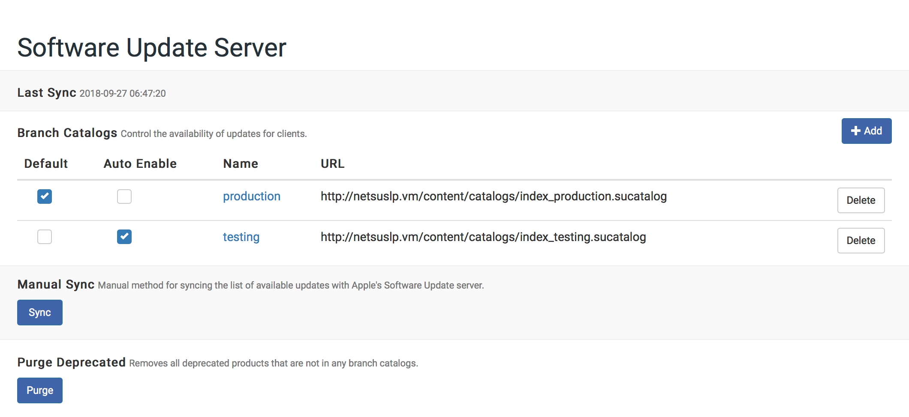
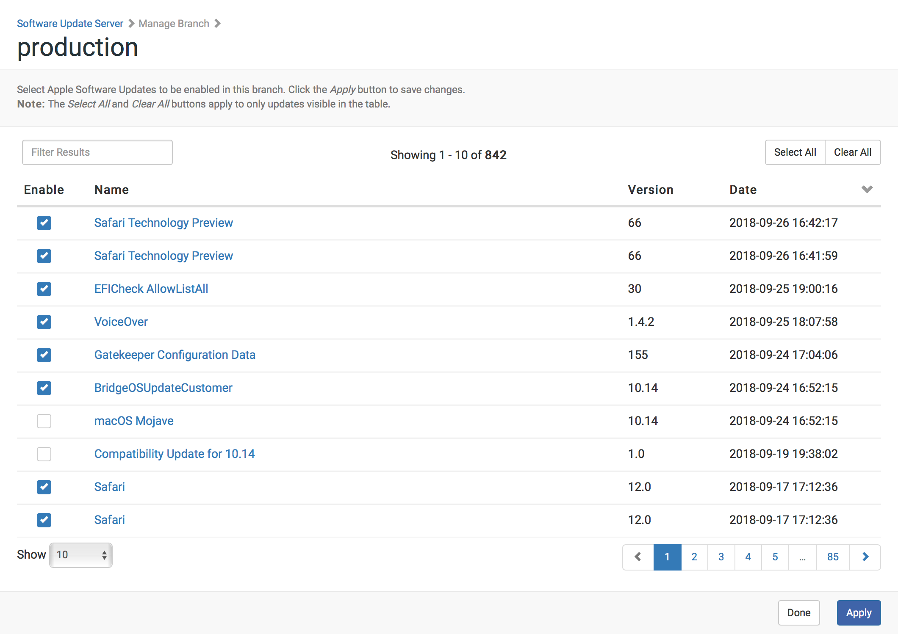

# Managing a Software Update Server (SUS)

The SUS hosted by the NetSUSLP uses Reposado, an open source software update application.
Unlike a standard SUS, you can divide the SUS hosted by the NetSUSLP into branches and enable different software updates on each branch. This gives you more control over which updates should be installed on each computer in your organization.

## Setting Up the SUS

1. Log in to the NetSUSLP web application.

2. In the top-right corner of the page, click **Settings**  .

3. In the "Services" section, click **Software Update Server**  .

4. In the top-right corner of the page, click the  toggle so it displays  .

5. Enter the Base URL for the software update service and tab out of the field.\
   **Note**: NetSUSLP 5.0 allows for HTTPS to be used for the Base URL.

    

6. Optionally, check "Store Updates on this Server" to cache updates on the NetSUSLP.\
   **Note**: this will use a significant amount of disk space.

7. Optionally, select a scheduled time for the server to perform a daily sync.

8. Optionally, select the Apple Catalog URLs you wish to replicate.\
   Tip: Select only the Catalogs that are relevant to your environment to reduce the disk space required, if caching updates.

    

9. Optionally, specify any additional Catalog URLs you would like to sync. e.g. beta or seed.

## Syncing with Apple's Software Update Servers

You can sync the list of available software updates with Apple’s Software Update servers manually or on a schedule.

1. Log in to the NetSUSLP web application.

2. Click **Software Update Server** in the side navigation menu.

3. Click the **Sync** button under Manual Sync.\
   **Note**: the Sync Schedule is now located in the Software Update Server settings.

    

## Creating a Branch

Once the initial sync has been performed you can create braches for the Software Update catalogs.
**Note**: The branch URLs displayed provide the appropriate re-directs to the correct catalog for the detected user agent.

1. Log in to the NetSUSLP web application.

2. Click **Software Update Server** in the side navigation menu.

3. Click the **+ Add** button in the upper-right of the table.

4. Enter the Branch Name in the modal dialog.\
   **Note**: You can clone an existing branch, if there is one.

5. Click **Save**.\
   **Note**: The branch catalog will not be populated until either an update is enabled or a Sync is performed.

6. Optionally, you may set the branch as the default, which makes it available at:

	`http(s)://<hostanme>/index.sucatalog`

7. Optionally, you may set the branch to automatically enable new updates, which is useful if you are simply caching updates.

    

## Managing Branches

The NetSUSLP web application allows you to manage the available updates in each branch:

1. Log in to the NetSUSLP web application.

2. Click **Software Update Server** in the side navigation menu or in the mobile dropdown menu.

3. Click the name of branch you want to configure.

4. Select (or clear) the updates you wish to enable.\
   **Note**: The **Select All** and **Clear All** buttons apply to only updates visible in the table. If you wish to select or clear all updates in the branch, select **All** from the "Show" menu at the bottom-left of the table.

5. Click **Apply**.

    
    

# Using the SUS with Jamf Pro

Like a standard SUS, you can use the SUS hosted by the NetSUSLP to run Software Update on computers that are enrolled with Jamf Pro. This involves pointing computers at a branch, and then using a policy or Jamf Remote to run Software Update on the computers.

## Pointing Computers at a SUS Branch
**Note**: The instructions in this section are for Jamf Pro v9.0 or later. However, if you are using the Casper Suite v8.x, these instructions can still be followed loosely.

There are several ways to point computers at a SUS branch:

* Use network segments (root branch only) 
* Use a configuration profile
* Use Managed Preferences
* Use a policy or Jamf Remote

### Pointing Computers at a SUS Branch Using Network Segments

This method is available for the root branch only. It involves adding the root branch to Jamf Pro as a software update server, and then using network segments to set a default software update server for computers.

For more information, see the “Software Update Servers” and “Network Segments” sections in the Jamf Pro Administrator’s Guide.

When adding the root branch to Jamf Pro as a software update server, be sure to enter “80” for the port.

### Pointing Computers at a SUS Branch Using a Configuration Profile

Create a configuration profile with the branch URL entered in the **Software Update Server** field in the Software Update payload.

For more information on creating configuration profiles, see the “OS X Configuration Profiles” section in the Jamf Pro Administrator’s Guide.

For more information on branch URLs, see the “Branch URLs” section below.

### Pointing Computers at a SUS Branch Using Managed Preferences

Create a Managed Preference profile with the branch URL entered in the **Software Update Server** field in the Software Update payload.

For more information on creating Managed Preference profiles, see the “Managed Preferences” section in the Jamf Pro Administrator’s Guide.

For more information on branch URLs, see the “Branch URLs” section below.

### Pointing Computers at a SUS Branch by Executing a Command

Use a policy or Jamf Remote to execute the following command on managed computers:
	
	defaults write /Library/Preferences com.apple.SoftwareUpdate CatalogURL <Branch URL>

Substitute `<Branch URL>` with the branch URL. For more information, see the “Branch URLs” section below.

You can execute a command from the Advanced pane in Jamf Remote, or from the Files and Processes payload in a policy.

### Branch URLs
The default branch URL shown in the web interface will re-direct the client system(s) to the appropriate catalog URL for the operating system.\
The actual Branch URLs vary depending on the operating system of enrolled computers. For reference example branch URLs are listed below.

**OS X v10.4**

	http://sus.mycompany.corp/content/catalogs/index_<Branch Name>.sucatalog
		
**OS X v10.5**

	http://sus.mycompany.corp/content/catalogs/others/index-leopard.merged-1_<Branch Name>.sucatalog
		
**OS X v10.6**

	http://sus.mycompany.corp/content/catalogs/others/index-leopard-snowleopard.merged-1_<Branch Name>.sucatalog

**OS X v10.7**

	http://sus.mycompany.corp/content/catalogs/others/index-lion-snowleopard-leopard.merged-1_<Branch Name>.sucatalog
   
**OS X v10.8**

	http://sus.mycompany.corp/content/catalogs/others/index-mountainlion-lion-snowleopard-leopard.merged-1_<Branch Name>.sucatalog
	
**OS X v10.9**

	http://sus.mycompany.corp/content/catalogs/others/index-10.9-mountainlion-lion-snowleopard-leopard.merged-1_<Branch Name>.sucatalog
	
**OS X v10.10**

	http://sus.mycompany.corp/content/catalogs/others/index-10.10-10.9-mountainlion-lion-snowleopard-leopard.merged-1_<Branch Name>.sucatalog
	
**OS X v10.11**

	http://sus.mycompany.corp/content/catalogs/others/index-10.11-10.10-10.9-mountainlion-lion-snowleopard-leopard.merged-1_<Branch Name>.sucatalog
	
**macOS v10.12**

	http://sus.mycompany.corp/content/catalogs/others/index-10.12-10.11-10.10-10.9-mountainlion-lion-snowleopard-leopard.merged-1_<Branch Name>.sucatalog
	
**macOS v10.13**

	http://sus.mycompany.corp/content/catalogs/others/index-10.13-10.12-10.11-10.10-10.9-mountainlion-lion-snowleopard-leopard.merged-1_<Branch Name>.sucatalog
	
**macOS v10.14**

	https://sus.mycompany.corp/content/catalogs/others/index-10.14-10.13-10.12-10.11-10.10-10.9-mountainlion-lion-snowleopard-leopard.merged-1_<Branch Name>.sucatalog
	
### Running Software Update on Computers

For instructions on using Jamf Pro to run Software Update on computers that are managed by the Jamf Pro Server, see the “Running Software Update” section in the Jamf Pro Administrator’s Guide.

### macOS Mojave

macOS Mojave's softwareupdate by default requires the use of https. It also performs extended validation of TLS certificates.\
To disable this, use a policy or Jamf Remote to execute the following command on managed computers:

	sudo defaults write /Library/Preferences/com.apple.SoftwareUpdate SUDisableEVCheck -bool TRUE

This preference may also be set using a Configuration Profile.

**Note**: For macOS Mojave clients the Base URL should be set to https.