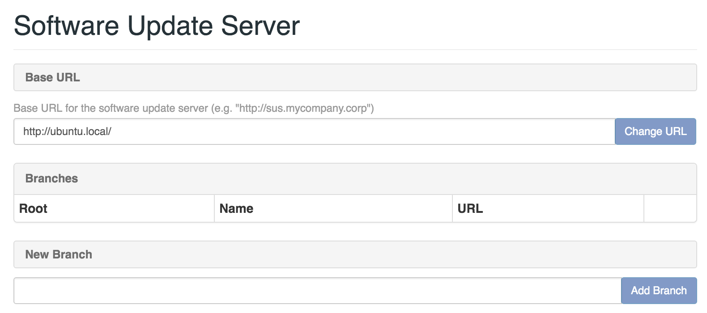
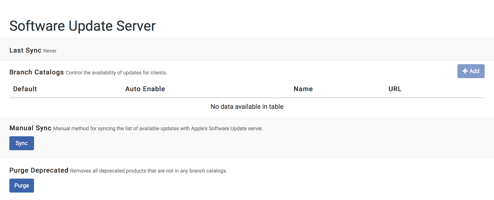
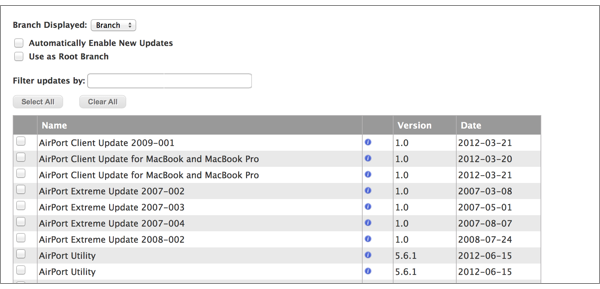

# Managing a Software Update Server (SUS)

The SUS hosted by the NetBoot/SUS/LP server uses Reposado, an open source software update application.
Unlike a standard SUS, you can divide the SUS hosted by the NetBoot/SUS/LP server into branches and enable different software updates on each branch. This gives you more control over which updates should be installed on each computer in your organization.

## Setting Up the SUS

1. Log in to the NetBoot/SUS/LP server web application.

2. Click **Software Update Server** in the side navigation menu or in the mobile dropdown menu.

3. Enter a base URL and click Change URL.

    

4. Create at least one branch by typing a branch name in the New Branch field and clicking Add. Repeat as needed for each branch.

## Syncing with Apple's Software Update Server

You can sync the list of available software updates with Apple’s Software Update server manually or on a schedule.

1. Log in to the NetBoot/SUS/LP server web application.

2. Click **Software Update Server** in the side navigation menu or in the mobile dropdown menu.

3. Sync the list of available software updates manually, or choose a time to sync the list each day.

    
	
## Configuring SUS Branches

The NetBoot/SUS/LP server web application allows you to do the following for each branch:

* Make the branch the root.
* Manually enable or disable software updates. 
* Automatically enable new software updates.
1. Log in to the NetBoot/SUS/LP server web application.

2. Click **Software Update Server** in the side navigation menu or in the mobile dropdown menu.

3. Click the branch you want to configure.

4. Configure the branch using the settings on the pane.

    
    
5. Click **Apply** below the list of software updates or at the top of the page.

# Using the SUS with the Casper Suite

Like a standard SUS, you can use the SUS hosted by the NetBoot/SUS/LP server to run Software Update on computers that are enrolled with the JSS. This involves pointing computers at a branch, and then using a policy or Casper Remote to run Software Update on the computers.

## Pointing Computers at a SUS Branch
**Note:** The instructions in this section are for the Casper Suite v9.0 or later. However, if you are using the Casper Suite v8.x, these instructions can still be followed loosely.

There are several ways to point computers at a SUS branch:

* Use network segments (root branch only) 
* Use a configuration profile
* Use Managed Preferences
* Use a policy or Casper Remote

### Pointing Computers at a SUS Branch Using Network Segments

This method is available for the root branch only. It involves adding the root branch to the JSS as a software update server, and then using network segments to set a default software update server for computers.

For more information, see the “Software Update Servers” and “Network Segments” sections in the Casper Suite Administrator’s Guide.

When adding the root branch to the JSS as a software update server, be sure to enter “80” for the port.
    
### Pointing Computers at a SUS Branch Using a Configuration Profile

Create a configuration profile with the branch URL entered in the **Software Update Server** field in the Software Update payload.

For more information on creating configuration profiles, see the “OS X Configuration Profiles” section in the Casper Suite Administrator’s Guide.

For more information on branch URLs, see the “Branch URLs” section below.

### Pointing Computers at a SUS Branch Using Managed Preferences

Create a Managed Preference profile with the branch URL entered in the **Software Update Server** field in the Software Update payload.

For more information on creating Managed Preference profiles, see the “Managed Preferences” section in the Casper Suite Administrator’s Guide.

For more information on branch URLs, see the “Branch URLs” section below.

### Pointing Computers at a SUS Branch by Executing a Command

Use a policy or Casper Remote to execute the following command on managed computers:
	
	defaults write /Library/Preferences com.apple.SoftwareUpdate CatalogURL <Branch URL>

Substitute `<Branch URL>` with the branch URL. For more information, see the “Branch URLs” section below.

You can execute a command from the Advanced pane in Casper Remote, or from the Files and Processes payload in a policy.

### Branch URLs
Branch URLs vary depending on the operating system of enrolled computers. Example branch URLs are listed below.

**OS X v10.5**

	http://sus.mycompany.corp/content/catalogs/others/index-leopard.merged-1_<Branch Name>.sucatalog
		
**OS X v10.6**

	http://sus.mycompany.corp/content/catalogs/others/index-leopard-snowleopard.merged-1_<Branch Name>.sucatalog

**OS X v10.7**

	http://sus.mycompany.corp/content/catalogs/others/index-lion-snowleopard-leopard.merged-1_<Branch Name>.sucatalog
   
**OS X v10.8**

	http://sus.mycompany.corp/content/catalogs/others/index-mountainlion-lion-snowleopard-leopard.merged-1_<Branch Name>.sucatalog
	
**OS X v10.9**

	http://sus.mycompany.corp/content/catalogs/others/index-10.9-mountainlion-lion-snowleopard-leopard.merged-1_<Branch Name>.sucatalog
	
**OS X v10.10**

	http://sus.mycompany.corp/content/catalogs/others/index-10.10-10.9-mountainlion-lion-snowleopard-leopard.merged-1_<Branch Name>.sucatalog
	
**OS X v10.11**

	http://sus.mycompany.corp/content/catalogs/others/index-10.11-10.10-10.9-mountainlion-lion-snowleopard-leopard.merged-1_<Branch Name>.sucatalog
	
### Running Software Update on Computers

For instructions on using the Casper Suite to run Software Update on computers that are managed by the JSS, see the “Running Software Update” section in the Casper Suite Administrator’s Guide.

